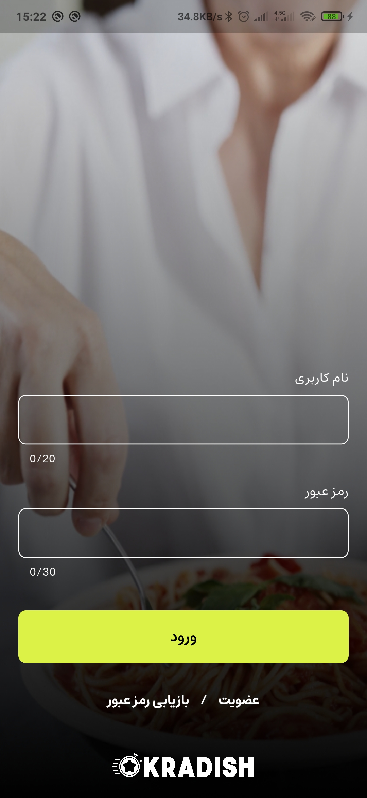
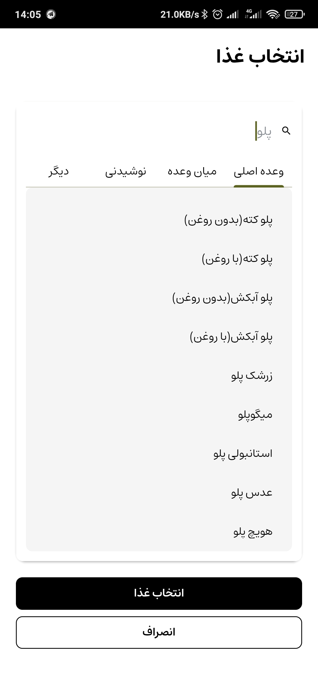
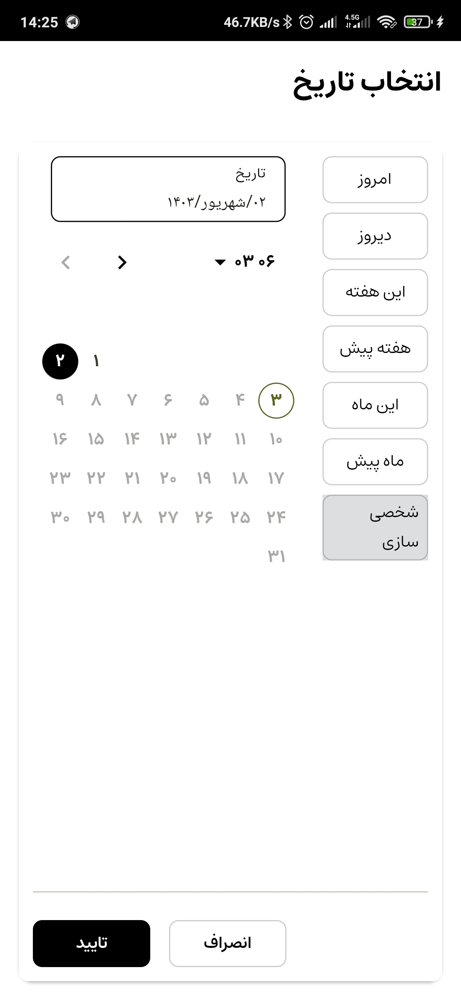
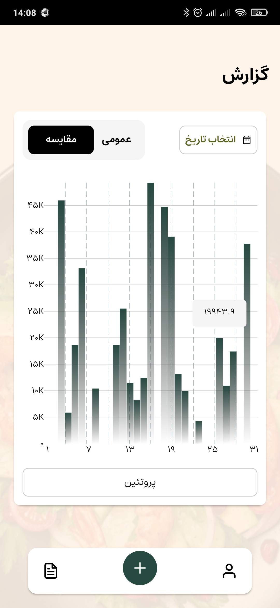
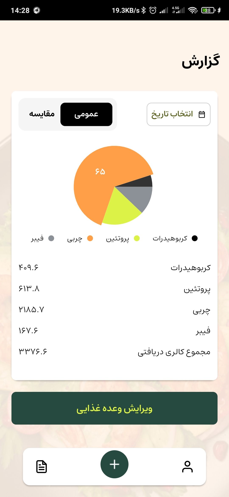
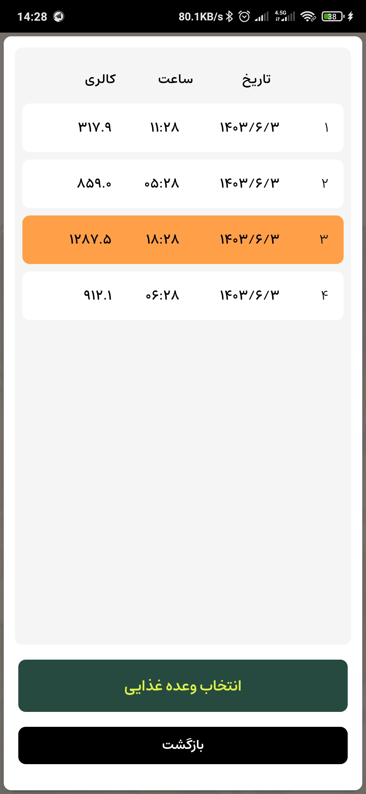

# Crop diseases
 A comprehensive diet monitoring app that provides detailed statistics on nutrient intake

 ## Key features:
 - Accurate calorie tracking based on food intake.
 - Measuring accurate real-time weight with BLE(Bluetooth Low Enenrgy) ESP32 scale
 - Detailed breakdown of macronutrients (protein, carbohydrates, fats).
 - Micronutrient tracking (vitamins, minerals).
 - Customizable food database with options to add new foods.

  

&nbsp;

## Authentication

&nbsp;

## Search and add foods

&nbsp;

## Explore statics by date

&nbsp;

&nbsp;

&nbsp;

## Show, edit and remove meals

&nbsp;

## Built With

<!---
## Game rules:
This game is a modified 2P chess with all chess rules plus some features:

&nbsp;

### Winner:
If game ends by checkmate or stalemate, winner is player who has more scores,
but if a player presses Surrend, other player wins.

&nbsp;

### Score:
Score is the key to win in this game, some movement have score:
- Hit: Pawn-> +3 , Queen-> +15 , others-> +8 (you can't hit the king!)
- Pawn pass away half of board: +3 
- Check enemy king: +10
- Checkmate: +50
- Extra move: if you have 30 scores, you can make an extra move!

&nbsp;

### Negative score:
Some works increases your negative score , if your negative score reachs 15 , you will have a random move on a random piece.
- Undo: return last moved piece and adds 5 negative scores
- Touch piece: if you choose a moveable piece and reselct in this turn, you'll get 5 negative scores 

&nbsp;

### Important notes
- Game has auto save and you can continue crashed or closed games
- Negative scores won't be saved in file
- For game name, if a file exists with the same name, file will be overwriten
- In promotion, if you don't choose any chessman, game will crash, but you can continue game by laoding it
- Canceling game will delete save file and restarting will clear move history in file
- Saved Files with free spaces or unreadable moves, won't be opened
 

&nbsp;

 
## Load Game
[![Load Screen Shot][Load]][Load]

&nbsp;

## Promotion Dialog
[![Promotion Screen Shot][Promotion]][Promotion]

--->
