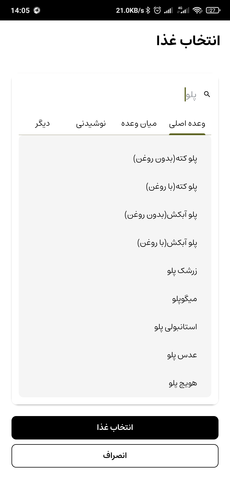
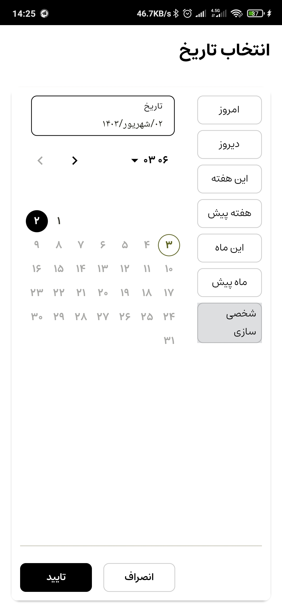
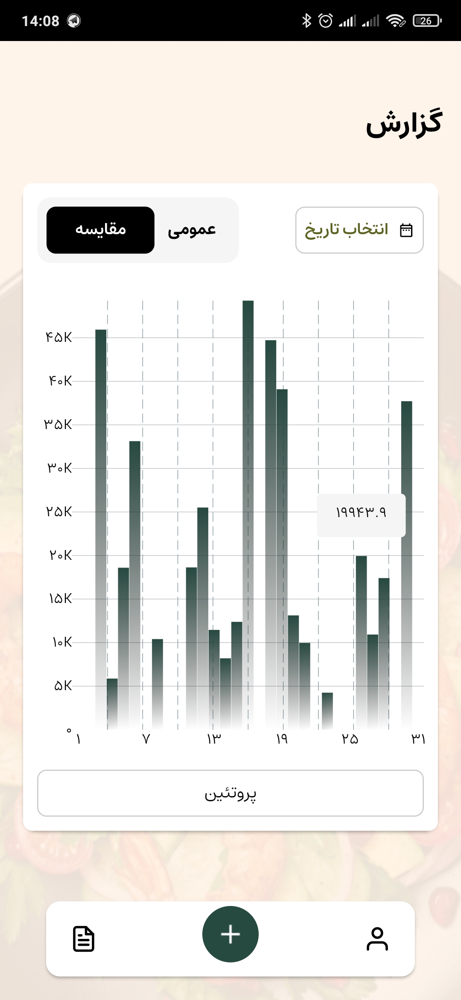
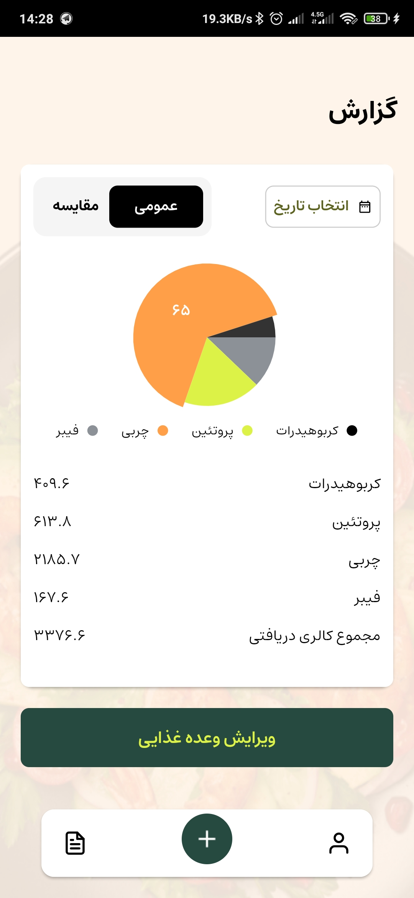
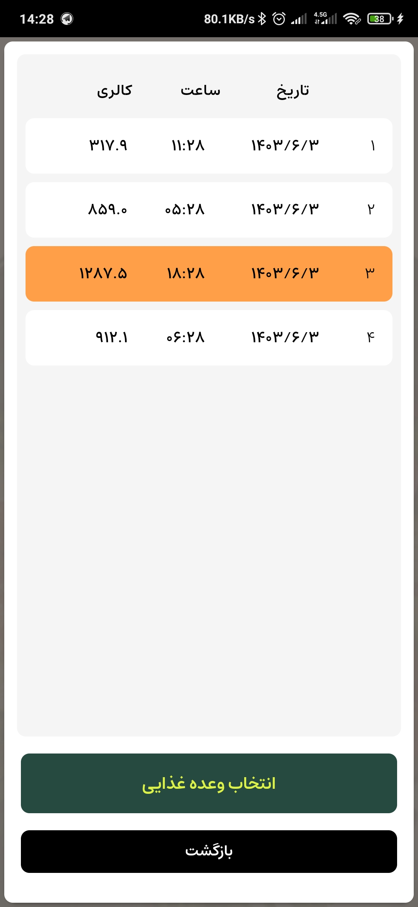

# OKARDISH  

**OKARDISH** is a Flutter-based diet monitoring application that helps users track nutrients, measure weight using BLE devices, and manage their food intake. This repository showcases my work as a **Flutter developer** on the OKARDISH project.  

---

## 📱 About the App  

OKARDISH is a powerful tool that allows users to:  

- Track calories and nutrients based on food intake  
- Measure accurate real-time weight with BLE (Bluetooth Low Energy) ESP32 scale  
- View detailed breakdown of macronutrients (protein, carbohydrates, fats)  
- Monitor micronutrients (vitamins, minerals)  
- Customize their food database with options to add new foods  
- Explore daily, weekly, and monthly nutrition statistics  

---

## 📌 Key Highlights  

- Real-time BLE scale integration  
- Clean and maintainable Flutter codebase using modern architecture  
- Smooth user experience with responsive UI  
- Efficient state management with GetX  
- Local data storage with Hive  
- Comprehensive error handling  
- Rich UI with custom components  

---

## 🛠️ Tech Stack & Dependencies  

Here’s a summary of the main technologies and packages used in the project:  

| Category | Package |
| -------- | ------- |
| **Framework** | [Flutter](https://flutter.dev) |
| **State Management** | [GetX](https://pub.dev/packages/get) |
| **Bluetooth** | [Flutter Blue Plus](https://pub.dev/packages/flutter_blue_plus) |
| **Charts & Visualization** | [Fl Chart](https://pub.dev/packages/fl_chart) |
| **Storage** | [Hive](https://pub.dev/packages/hive), [Hive Flutter](https://pub.dev/packages/hive_flutter), [Path Provider](https://pub.dev/packages/path_provider) |
| **Localization** | [Flutter Localization](https://pub.dev/packages/flutter_localization), [intl](https://pub.dev/packages/intl) |
| **UI Components** | [Flutter SVG](https://pub.dev/packages/flutter_svg), [Video Player](https://pub.dev/packages/video_player), [Persian DateTime Picker](https://pub.dev/packages/persian_datetime_picker) |
| **Networking / Backend** | [Parse Server SDK Flutter](https://pub.dev/packages/parse_server_sdk_flutter) |
| **Connectivity** | [Connectivity Plus](https://pub.dev/packages/connectivity_plus) |
| **Splash / Branding** | [Flutter Native Splash](https://pub.dev/packages/flutter_native_splash), [Flutter Launcher Icons](https://pub.dev/packages/flutter_launcher_icons) |
| **Code Generation / Dev Tools** | [Build Runner](https://pub.dev/packages/build_runner), [Flutter Gen](https://pub.dev/packages/flutter_gen), [Hive Generator](https://pub.dev/packages/hive_generator) |
| **Linting / Testing** | [Flutter Lints](https://pub.dev/packages/flutter_lints), Flutter Test |

---

## 🗂️ Project Structure  

lib/
├── components/ # Reusable UI components
├── db/ # Database related code (Hive)
├── extensions/ # Dart extensions
├── generated/ # Generated code
├── models/ # Data models
├── pages/ # Application screens
├── services/ # Business logic & BLE integration
├── states/ # State management
├── utils/ # Utility functions
├── constant.dart # App constants
├── deps.dart # Dependency injection
├── main.dart # App entry point
└── routes.dart # App routing

---

## 📸 Screenshots  

| Screen | Screenshot |
| ------ | ----------- |
| Login |  |
| Search |  |
| Date Stats |  |
| Bar Chart |  |
| Pie Chart |  |
| Meals |  |

---

## 📄 License  

This is a proprietary project. All rights reserved.  

---

## 🔄 Dev Setup  

For development:  

- Flutter SDK: 3.x  
- Dart SDK: 3.x  
- VS Code or Android Studio with Flutter plugins  

_For more information about the app’s features and development, please contact the development team._  
